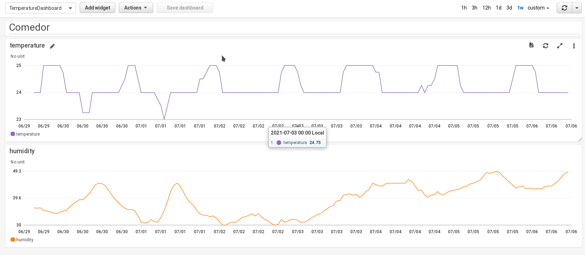

# TemperatureMetrics



## Status

|     | build  |
  --- |    --- |
|py agent|[](https://github.com/juanrh/TemperatureMetrics/actions/workflows/temp-metrics-d-py-ci.yml)|
|React online UI |[](https://github.com/juanrh/TemperatureMetrics/actions/workflows/online-temp-metrics-react-ui.yml)|
|Online agent |[](https://github.com/juanrh/TemperatureMetrics/actions/workflows/online-temp-metrics-agent.yml)|

## Design

A daemon running on a SBC with a temperature sensor sends temperature metrics to CloudWatch metrics at a regular cadence. We can visualize and aggregate the metrics using a CloudWatch dashboard.

## Setup

### Hardware

Raspberry PI 3B+ with GrovePi+ and Grove temperature and humidity sensor. See [deploy/rpi/README.md](deploy/rpi/README.md) for setup instructions.

### Software

See [agent/temp-metrics-d-py/README.md](agent/temp-metrics-d-py/README.md) for setup instructions for the Python agent.

Example cloduwatch dashboard: 

```json
{
    "widgets": [
        {
            "height": 1,
            "width": 24,
            "y": 0,
            "x": 0,
            "type": "text",
            "properties": {
                "markdown": "# Comedor"
            }
        },
        {
            "height": 6,
            "width": 24,
            "y": 1,
            "x": 0,
            "type": "metric",
            "properties": {
                "metrics": [
                    [ "temp_agent", "temperature", "source", "comedor", { "color": "#9467bd" } ]
                ],
                "view": "timeSeries",
                "stacked": false,
                "region": "eu-west-1",
                "stat": "Average",
                "period": 900
            }
        },
        {
            "height": 6,
            "width": 24,
            "y": 7,
            "x": 0,
            "type": "metric",
            "properties": {
                "metrics": [
                    [ "temp_agent", "humidity", "source", "comedor", { "color": "#ff7f0e" } ]
                ],
                "view": "timeSeries",
                "stacked": false,
                "region": "eu-west-1",
                "stat": "Average",
                "period": 900
            }
        }
    ]
}
```
